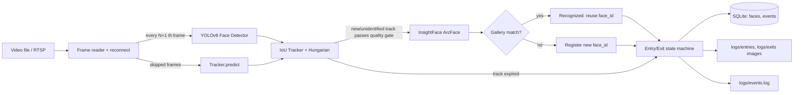

# Intelligent Face Tracker with Auto-Registration & Unique Visitor Counting

Real-time pipeline: **YOLOv8-face** (detection) → **IoU/velocity tracker** → **InsightFace ArcFace** (recognition) → **SQLite + filesystem + events.log**.
Works on a video file (dev) or an **RTSP stream** (interview) — just change `source`.

## 1. Setup
```bash
python -m venv venv && source venv/bin/activate      # Windows: venv\Scripts\activate
pip install -r requirements.txt                       # GPU: pip install onnxruntime-gpu
python scripts/download_models.py                     # YOLOv8 face weights (InsightFace buffalo_l auto-downloads)
# put the sample video at videos/sample.mp4
python main.py                                        # uses config.json
python main.py --source "rtsp://user:pass@ip:554/stream"   # live RTSP
python scripts/report.py                              # unique count + event table
```
Press `Ctrl+C` to stop gracefully (all in-frame faces get their exit event).

## 2. Sample `config.json`
```json
{
  "source": "videos/sample.mp4",
  "detection_skip_frames": 2,
  "yolo_model": "models/yolov8n-face.pt",
  "yolo_conf": 0.5,
  "device": "cpu",
  "recognition_threshold": 0.40,
  "min_face_size": 40,
  "min_track_hits": 3,
  "max_missed_detections": 6,
  "iou_threshold": 0.25,
  "db_path": "data/visitors.db",
  "log_dir": "logs",
  "display": false,
  "save_annotated_video": "output/annotated.mp4"
}
```
| Key | Meaning |
|---|---|
| `detection_skip_frames` | **Frames skipped between detection cycles** (2 ⇒ detect every 3rd frame; boxes are predicted in between) |
| `recognition_threshold` | Cosine similarity for ArcFace match (≥ ⇒ same person) |
| `min_track_hits` / `min_face_size` | Quality gate before a face is identified/registered |
| `max_missed_detections` | Detection cycles without a match before a track is declared exited |
| `device` | `cpu` or `cuda` |

## 3. AI Planning Document

**Features**
1. Face detection (YOLOv8-face) on every Nth frame, N from `config.json`.
2. Multi-face tracking with constant-velocity prediction between detections + Hungarian IoU association.
3. ArcFace embeddings (InsightFace buffalo_l, 512-d), landmark-aligned.
4. Auto-registration of unseen faces with unique ID; re-identification via cosine similarity; EMA embedding refinement.
5. Exactly one **entry** and one **exit** event per visit (cropped image + timestamp + type + face ID).
6. Fragment merging: if a face is re-detected under a new track while its old track is still alive, it is treated as the same visit (no duplicate entry).
7. Unique visitor count = `COUNT(*) FROM faces`; re-identification never increments it.
8. Mandatory `events.log`: entry, recognition, tracking, exit, embedding generation, registration.
9. Resilience: SQLite WAL + commit per write, gallery reloaded on restart, RTSP auto-reconnect, graceful shutdown flush.
10. Annotated output video with live count overlay.

**Planning steps:** (1) define data model & events → (2) detector/recognizer wrappers → (3) tracker → (4) identity & event state machine → (5) logging/DB → (6) tune thresholds on the sample video → (7) RTSP hardening.

**Compute estimate** (720p–1080p @ ~25 fps, skip=2, 1–5 faces)
| | CPU (modern 8-core) | GPU (RTX 3050+) |
|---|---|---|
| YOLOv8n-face | ~25–40 ms / detection cycle | ~4–8 ms |
| ArcFace embed | ~30–60 ms, only for *unidentified* tracks | ~5–10 ms |
| Tracker / DB / IO | < 2 ms / frame | < 2 ms |
| Approx. load | 1.5–3 cores, ~1.5 GB RAM | ~10–20% GPU, ~1 GB VRAM |

Embeddings run only until a track is identified, so steady-state cost is detection only.

## 4. Architecture


## 5. Output structure
```
logs/events.log
logs/entries/YYYY-MM-DD/<time>_face<ID>_entry.jpg
logs/exits/YYYY-MM-DD/<time>_face<ID>_exit.jpg
data/visitors.db      # tables: faces(face_id, first_seen, embedding, image_path), events(face_id, event_type, timestamp, image_path, track_id)
output/annotated.mp4
```

## 6. Assumptions
- A "visit" = continuous presence; leaving and returning later logs a new entry/exit but **does not** increase the unique count.
- Timestamps use system wall-clock time (video time is also in `events.log`).
- Faces smaller than `min_face_size` px are ignored (too unreliable to register).
- Single camera; the identity gallery is persisted, so restarting resumes the same IDs (delete `data/` for a fresh run).
- YOLO face weights from `akanametov/yolov8-face` (change `yolo_model` for any YOLO face model).

## 7. Sample output
Run on the provided video, then commit `logs/`, `data/visitors.db` and `output/` as sample output.

## 8. Demo video
**Loom / YouTube link:** _add here_

---
This project is a part of a hackathon run by https://katomaran.com
